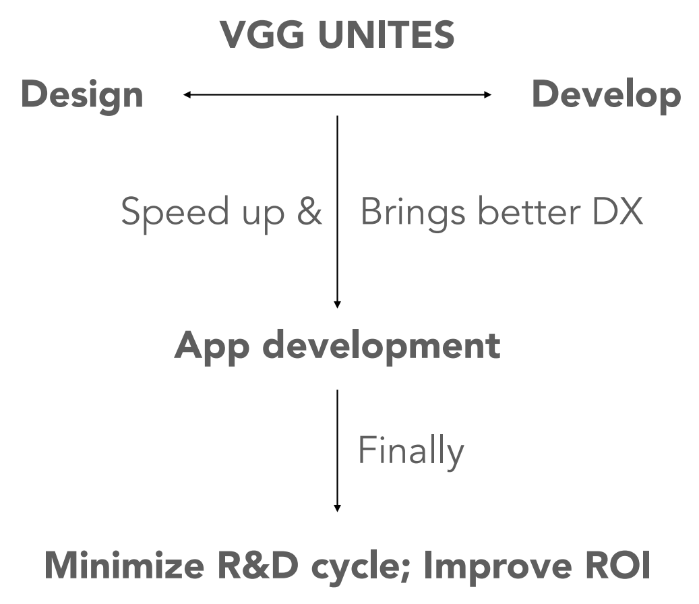
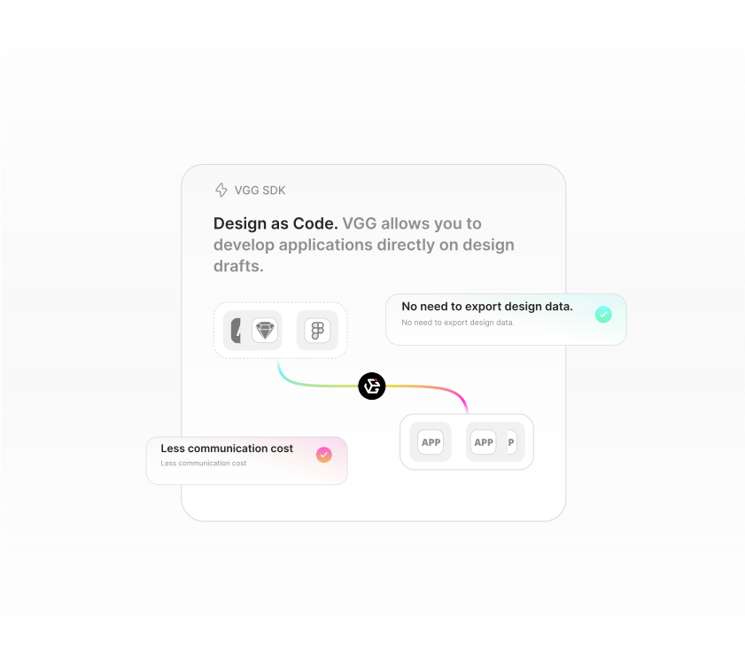
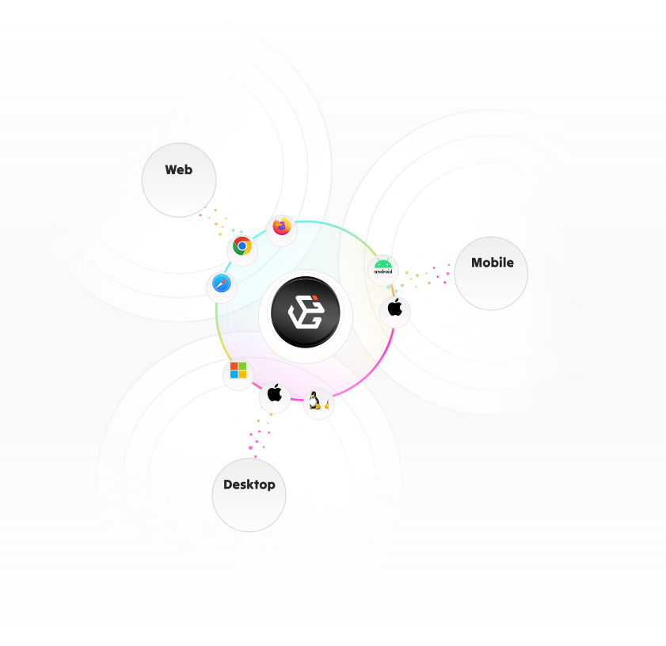

# Introduction

VeryGoodGraphics (VGG) is an innovative application development toolkit that
seamlessly unites two worlds of design and code for full-stack front-end
developers.

{: style="width:50%;margin:0 auto;display:block;"}

VGG was designed from the ground up with developer experience (DX) in mind,
along with three main features.

- Design as Code
- Cross Platform
- Ecosystem Compatibility

## Design as Code

Thanks to [VGG Daruma](what/daruma.md), which is a file format with an open
standard specification containing both design part and code part, VGG allows
you to develop applications directly on design drafts, eliminating the need to
write UI code on your own. More details could be found in [Quick
Start](quick_start.md).

This so-called _Design as Code_ workflow will save your time abundantly as it
has great advantages over the traditional application development workflow or
even the emerging _Design to Code_ workflow where UI code is generated by
machine.

## Cross Platform

Thanks to [VGG Runtime](what/runtime.md) and WebAssembly, VGG applications are
able to run on all major platforms including desktop, mobile and web, with
consistent UI visual effects and interaction behaviors independent of the
platform.

## Ecosystem Compatibility

With VGG, you don't have to learn a new programming language, nor read verbose
manuals of a low-code system and then worry about compatibility problems or
even lock-in problems.

With VGG, you can use your familiar programming languages and tools since VGG
is not only compatible with common design tools (thanks to VGG Daruma), but
also integrates seamlessly with mainstream development frameworks and IDEs. VGG
achieves this compatibility through embedded components and plugins. You have
the freedom to decide whether to use it in your existing project, as it comes
at an almost negligible cost.

