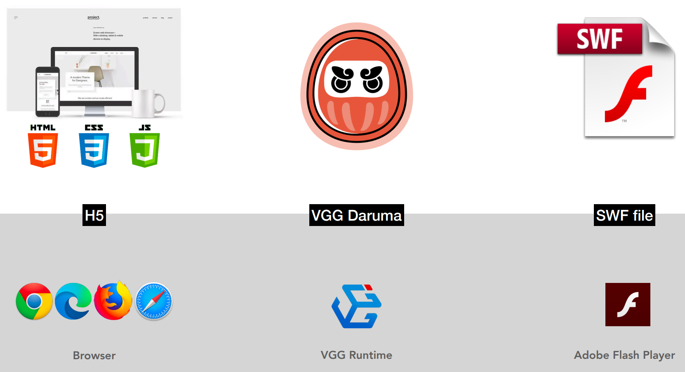

# Relationship between Daruma and Runtime

[VGG Daruma](daruma.md) is a self-contained file format with everything needed
to run an App including UI, layout, resources, and code. VGG takes Daruma as
its underlying application format and uses [VGG Runtime](runtime.md) to render
and run VGG applications.

The relationship between Daruma and Runtime is like that between HTML/CSS/JS
and browsers, and is also like that between SWF file and Flash player.
